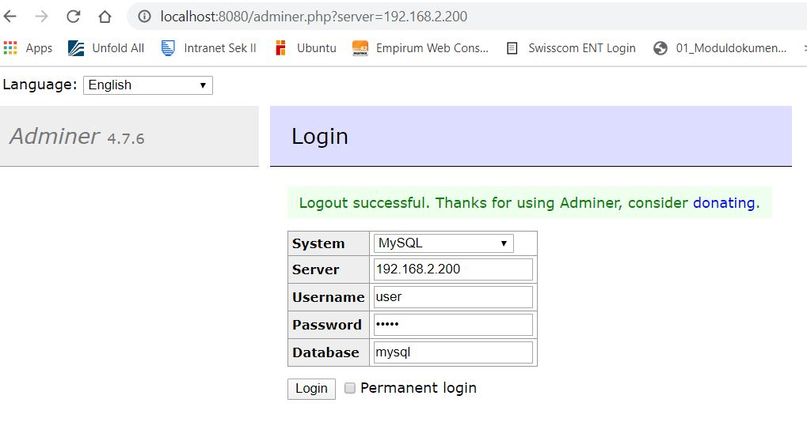
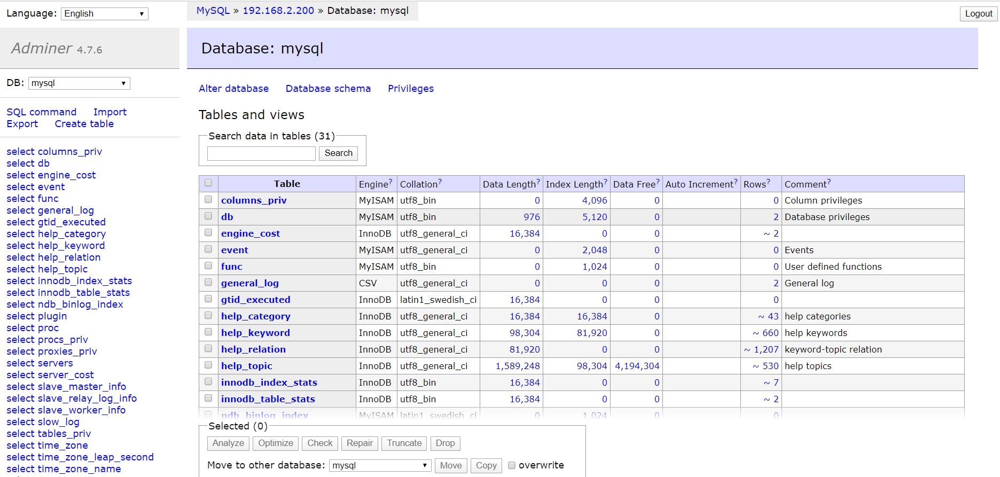

 ## Multi Machine DB

```
*-------------------------------------------------*
| Notebook                                        |
| Homenetz: 192.168.1.0                           |
| Privates Netz: 192.168.2.0                      |                 
| Port: 8080 (192.168.2.201:80)                   |
| Virtualbox-6.1.2                                |
*-------------------------------------------------*	
```
##### NETZ-ID: 192.168.2.0
| Server              | Hostname            | IP-Adresse          | Netz                | Port                |
|:--------------------|:--------------------|:--------------------|:--------------------|:--------------------|
| Web-Server: apache2 | lb2web              | 192.168.2.201       | NAT: 80             | 8080                |
| DB-Server: mysql    | lb2db               | 192.168.2.200       | __                  | 3306                |

- Der mmdb-Vagranfile lokal speichern.
- Der Code nach eigene Anforderungen anpassen. 
- Beim IP-Anpassungen muss diese Änderung auf dem **db.sh** auch eingetragen werden.
- Die Server (mysql & apache2) sind im gleichen Netz (192.168.2.0).
- Die Änderungen speichern. (auf vim -> :wq)
- Vagrant up
``` 
cd c:/Users/hajar/mym300prj/mmdb 
vagrant up 
```
- **Vagrant** sucht im Internet nach aufgerufene Dienst. Nachher werden die Dateien local speichern.
- Web-Server und DB-Server laufen auf dem Virtualbox.
- Zugriff auf dem Weboberfläche für Mysql-User ist wie folgt:

<p> URL:http://localhost:8080/adminer.php <br>
 
**LOGIN-ANGABE:**  `Username: User` `Password: admin`





`Test`
- [x] Beim Aufruf der URL wird der Adminer.php loginseite angezeigt.
- [x] **Vagrantfile**, **Fotos**, **.gitignore** und **db.sh** erfolgreich auf dem Github-Repository gepusht.

##### Zurück zur LB2Dokumentation: https://github.com/hajhos/mym300prj/blob/master/LB2Dokumentation.md
